# Active Context: ShellGPT

**Current Work Focus:**  

- Maintain robust CLI for LLM-powered shell/code generation, chat, and REPL.
- Ensure safety, extensibility, and context management.
- **Question functionality (`??` trigger) COMPLETED with comprehensive test coverage.**
- Ready to proceed with next major feature: Chain of Thought reasoning or context management.

**Recent Changes:**  

- Modularized handler architecture.
- Enhanced command safety (YAML config, user control).
- Improved REPL/chat integration.
- Added function calling and user roles.
- **✅ COMPLETED: Question Mode with comprehensive test coverage**
  - Implemented QuestionHandler with enhanced visual formatting
  - Added REPL integration with `??` trigger detection
  - Created ChatHandler.add_message method for context continuity
  - Fixed critical chat role establishment bug
  - Added 31 comprehensive tests covering all functionality aspects

**Next Steps:**  

1. **~~Question Mode in REPL + Shell (`??` Trigger):~~** ✅ **FULLY COMPLETED WITH COMPREHENSIVE TEST COVERAGE**
   - ✅ Allow users to ask general questions while in REPL + shell mode by appending `??` to input
   - ✅ Questions treated as normal assistant queries instead of shell commands
   - ✅ Enhanced visual formatting with indentation and different colors
   - ✅ Include questions/answers in same conversation context as shell commands
   - ✅ New QuestionHandler integrated into REPL routing logic
   - ✅ Use default assistant role for question responses
   - ✅ **Added 31 comprehensive tests (100% passing)**
   - ✅ **Fixed critical chat role establishment bug**
   - ✅ **All integration and edge cases covered**

2. **Chain of Thought (CoT) Reasoning:** [FUTURE FEATURE]
   - LLM-powered intent classification and transparent decision-making process
   - Visible reasoning steps for all handlers
   - Enhanced context expansion and clarification
   - Multi-step reasoning display for user understanding

3. **Condense Context Window:** Add feature to summarize/condense chat/repl history to fit LLM context limits.

4. **Global Memory:** Implement persistent, cross-session memory (e.g., global_memory.json) for facts/preferences.

5. **Reset Context Window:** Add command to clear/reset current chat/repl context.

6. **Context Window Management:** Expose commands to view, trim, or export current context.

7. **Credential Safety:** Enhance safety to detect and prompt before sending commands/outputs that may reveal credentials or sensitive info.

**Active Decisions & Considerations:**  

- All context is currently per-session (chat/repl); global memory is a planned feature.
- Safety config is user-editable and pattern-based.
- Handlers are the main extension point for new features.
- **Question mode (`??`) fully implemented with comprehensive test coverage.**

**Patterns & Preferences:**  

- Use decorators for caching.
- Use Typer for CLI and handler dispatch.
- Prefer explicit user confirmation for risky actions.
- Visual distinction for different interaction types (shell vs questions).
- Comprehensive testing for all new features (unit, integration, edge cases).

**Learnings & Insights:**  

- Context window can grow unbounded; condensation is needed for long sessions.
- Credential detection is non-trivial; pattern-based approach is a baseline.
- Users need seamless way to ask questions without leaving shell workflow.
- **Chat role establishment crucial for session continuity - system messages required.**
- **Testing edge cases prevents production bugs (empty responses, unicode, etc.).**

**Feature Specifications:**

### ✅ Question Mode (`??` Trigger) - COMPLETED
**Implementation Status:** Fully implemented and tested

- **Trigger Detection:** ✅ Input suffix `??` detection in REPL loop
- **Input Processing:** ✅ Prompt cleaning (`??` suffix removal) with QuestionHandler
- **Visual UX:** ✅ Indented cyan responses with `💡 Answer:` header
- **Architecture:** ✅ QuestionHandler routed from REPL dispatcher
- **Context Integration:** ✅ Conversation continuity with add_message method
- **Role System:** ✅ Default assistant role for general questions
- **Bug Fixes:** ✅ System message establishment for new chat sessions
- **Test Coverage:** ✅ 31 comprehensive tests (unit, integration, edge cases)

### Chain of Thought (Future)
**Implementation Scope:**

- **Intent Classification:** Determine question vs command vs code generation
- **Reasoning Display:** Show step-by-step thought process to user
- **Handler Integration:** Available to all handlers for enhanced decision-making
- **Prompt Engineering:** Specialized prompts for different reasoning contexts

**Mermaid: Updated Priorities**

```mermaid
graph TD
    subgraph "✅ Completed"
        QM[Question Mode ??]
        QH[QuestionHandler]
        VF[Visual Formatting]
        TC[Test Coverage]
    end
    
    subgraph "Next Phase"
        COT[Chain of Thought]
        CC[Context Condensation]
        GM[Global Memory]
    end
    
    QM --> QH
    QH --> VF
    VF --> TC
```


    VF --> COT
    COT --> CC
    CC --> GM
```
